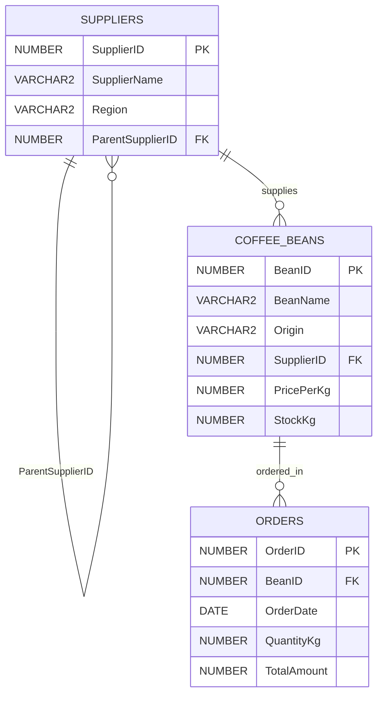

# Business Problem
The Coffee Bean Supplier Management System is designed to manage a global network of coffee bean suppliers, their hierarchical relationships, inventory levels, and sales orders. The business faces challenges in tracking supplier performance across different regions, analyzing sales trends over time, and optimizing inventory based on historical order data. This project utilizes advanced SQL techniques (CTEs and Window Functions) to extract actionable insights, evaluate supplier hierarchies, and rank product performance to support data-driven decision-making for procurement and sales strategies.

# Analysis and Findings
---
## Descriptive Analysis (What happened?)
The data reveals that the Africa region (specifically Ethiopia and Kenya) generates the highest volume of premium-priced transactions. The Yirgacheffe bean (ID 101) and Kenya AA (ID 103) are the most frequently ordered items. The recursive hierarchy shows a centralized HQ structure in Africa and South America, with localized subsidiaries handling specific origins.

## Diagnostic Analysis (Why did it happen?)
The high sales in the African region are directly correlated with the high PricePerKg of their beans (averaging $15.00+), indicating strong market demand for specialty-grade African coffee. The hierarchical supplier structure (identified via Recursive CTE) ensures strict quality control from the HQ down to the local farms, which justifies the premium pricing and drives consistent B2B orders.

## Prescriptive Analysis (What actions should be taken?)
Inventory Optimization: Increase the StockKg for Yirgacheffe and Kenya AA as they are the top sellers but currently hold moderate stock levels (500kg and 400kg).
Supplier Expansion: The South American region shows high volume but lower price margins. The business should negotiate long-term contracts with Medellin Select to secure bulk pricing for budget-conscious clients.
Marketing Strategy: Utilize the NTILE pricing tiers to bundle premium African beans with mid-tier South American beans to create diverse portfolio packages for international buyers.

## Academic Integrity Statement
"I declare that this submission is my own original work. I have not copied any part of this assignment from classmates, online repositories, or any other unauthorized sources. All SQL scripts, business scenarios, and analyses were developed independently in accordance with the university's academic integrity regulations."
